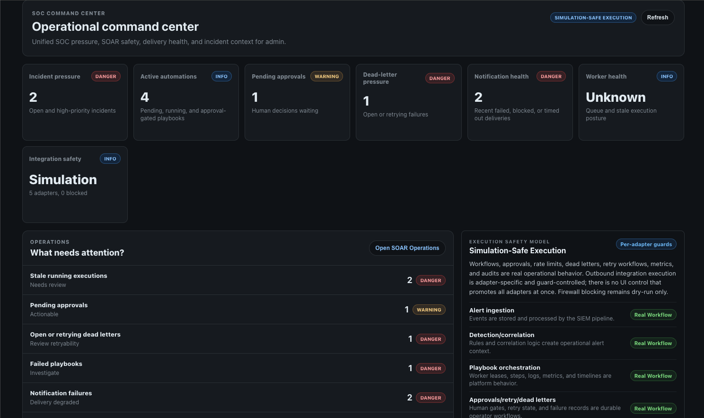
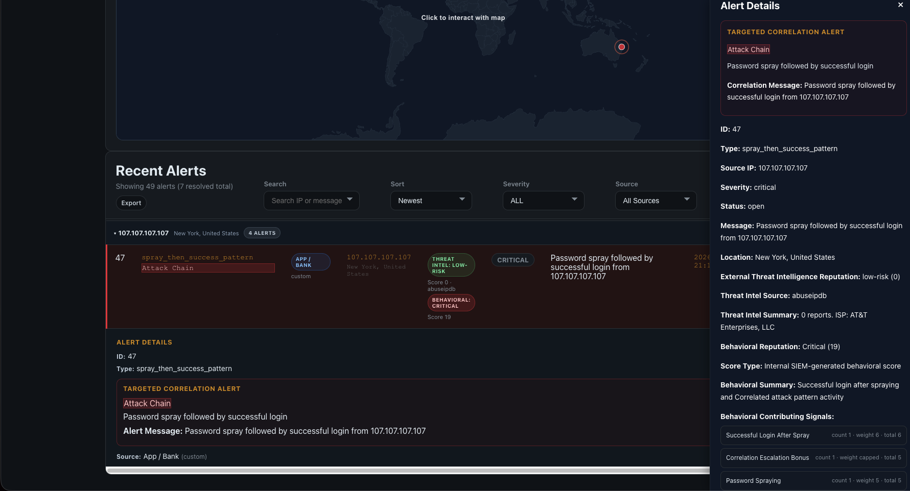
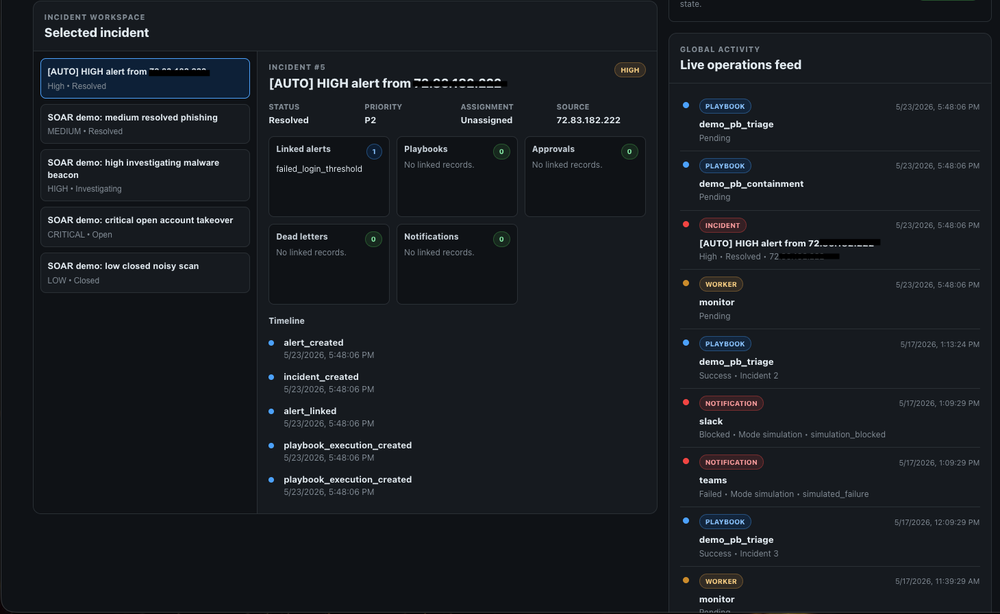
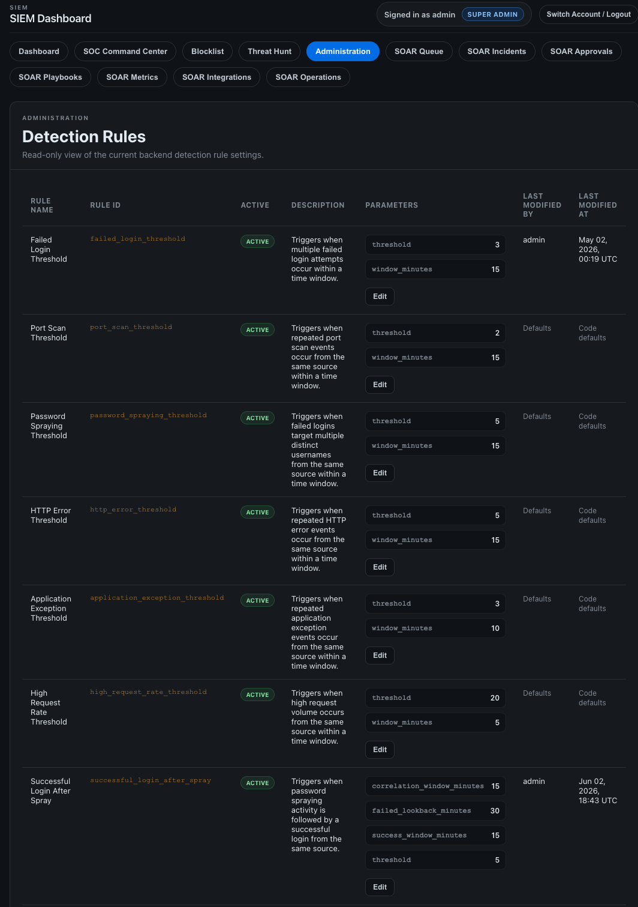

# SIEM Security Dashboard

Full-stack SIEM/SOAR security operations platform built to demonstrate realistic
SOC workflows, detection engineering, incident response automation, and
simulation-safe integration design.

The platform ingests security telemetry, detects suspicious behavior, correlates
alerts, creates incidents, runs SOAR playbooks, tracks approvals and failures,
and exposes an operational security console for analysts and administrators.

## What This Project Demonstrates

- SIEM event ingestion, detection, correlation, alerting, and reporting.
- SOC analyst workflows with incidents, threat hunting, MITRE context, notes,
  assignments, and role-based access.
- SOAR orchestration with daemonized playbook execution, worker leases, stale
  recovery, approvals, dead letters, retry workflows, metrics, and audit trails.
- Guarded integration architecture for Slack, Teams, email, and webhooks.
- Simulation-safe execution by default, with firewall actions intentionally
  dry-run only.
- Productized demo surfaces: SOC Command Center, SOAR Playbooks, SOAR
  Operations, SOAR Metrics, and integration safety status.

## Current Architecture

```text
External apps / simulators / log sources
  -> /ingest and source-specific ingestion routes
  -> PostgreSQL event storage
  -> detection engine + correlation engine
  -> alerts and incidents
  -> SOAR playbook queue/executions
  -> daemonized worker with leases and stale recovery
  -> approvals, dead letters, notification delivery, metrics, audit logging
  -> guarded integration adapters
  -> React SOC/SIEM/SOAR console
```

SOAR is downstream of detection and correlation. Response automation does not
run inside the ingest transaction.

## Core Capabilities

### SIEM

- JSON event ingestion through protected APIs.
- Source adapters for Azure Application Insights, OpenTelemetry, nginx, and
  file/log ingestion workflows.
- Detection coverage for failed login thresholds, password spraying, successful
  login after spray, port scans, high request rates, suspicious HTTP activity,
  and targeted correlation.
- Alert grouping, duplicate suppression, enrichment, MITRE ATT&CK context, PDF
  reports, and threat-hunting views.
- RBAC, audit logging, session identity, admin user management, detection rule
  management, and blocklist tracking.

### SOAR

- Playbook definitions and execution records.
- Playbook step executor with simulation-safe defaults.
- Daemonized SOAR worker with lease ownership, stale recovery, bounded batches,
  and worker health metrics.
- Approval gates for human-in-the-loop decisions.
- Dead-letter queue with retryability classification, retry-request workflows,
  and duplicate-safe failure handling.
- Notification delivery tracking, rate limiting, and idempotency/deduplication.
- Guarded real-capable Slack, Teams, email, and webhook adapters.
- Firewall/block IP remains dry-run only. No live firewall mutation path exists.
- Redacted integration audit logging and integration status APIs.

### Frontend Console

- Main SIEM dashboard with alert tables, severity charts, source IP views, maps,
  reports, and admin workflows.
- SOC Command Center for incident pressure, active automations, pending
  approvals, dead-letter pressure, notification health, worker health, and
  integration safety.
- SOAR Playbooks panel with execution detail and visual execution timeline.
- SOAR Operations panel for dead letters, retry workflows, and operational
  recovery visibility.
- SOAR Metrics dashboard for execution, queue, worker, approval, notification,
  incident, and dead-letter metrics.
- Integration status panel with adapter readiness, circuit state, and execution
  safety model wording.

## Platform Screenshots

Production-style SIEM/SOAR console views showing operational monitoring,
investigation workflow, incident response context, and runtime rule management.

### SOC Command Center

Operational command view with incident pressure, active automations, pending
approvals, worker health, integration status, and response readiness.



### Alert Investigation

Alert detail workflow with severity, source context, MITRE mapping, reputation
signals, investigation metadata, and analyst action controls.



### Incident Workspace

Incident response workspace showing linked alerts, status tracking, ownership,
SOAR timeline context, notification history, and analyst notes.



### Runtime Detection Rule Management

Admin rule-management view with runtime-configurable detection thresholds,
time windows, severity, enablement, and audit-friendly rule metadata.



## Execution Safety Model

The platform is not a single global "real vs simulation" switch.

- Workflows, approvals, playbook execution records, dead letters, metrics, retry
  state, notification delivery records, and audit logs are real platform
  behavior.
- Outbound integrations are adapter-specific and guard-controlled.
- Real-capable adapters require explicit environment guards and credentials.
- Missing guards fail closed to simulation or blocked/skipped results.
- Firewall/blocking remains dry-run only.
- No autonomous destructive remediation is enabled.

For more detail, see `docs/soar_security_boundaries.md` and
`docs/soar_handoff.md`.

## Repository Structure

```text
siem-security-dashboard-public/
├── adapters/                 # External telemetry source adapters
├── core/                     # Stores, auth, DB, audit, SOAR safety helpers
├── docs/                     # Runbooks, handoffs, demo docs, validation guides
├── engines/                  # Ingest, detection, correlation, SOAR executors
├── frontend/                 # React app, components, services, tests, build output
├── helpers/                  # Shared normalization and backend helpers
├── integrations/             # SOAR integration adapters and guard utilities
├── migrations/               # Versioned PostgreSQL migrations
├── openspec/                 # Spec-driven change proposals and archive
├── routes/                   # Flask route modules
├── scripts/                  # Migration, ingest, worker, and deploy helpers
├── siem-azure-function/      # Azure Function ingestion source
├── tests/                    # Backend pytest suite
├── deploy.sh                 # Frontend artifact deploy helper
├── schema.sql                # Schema snapshot/reference
├── siem_backend.py           # Flask app entrypoint
└── simulate_attacks.py       # Local attack/demo event simulator
```

## Key Files

- Flask app entrypoint: `siem_backend.py`
- React app entrypoint: `frontend/src/App.js`
- SOC Command Center: `frontend/src/components/SocCommandCenter.js`
- SOAR execution timeline: `frontend/src/components/PlaybookExecutionTimeline.js`
- SOAR worker engine: `engines/soar_playbook_worker.py`
- Worker daemon script: `scripts/soar_playbook_worker_daemon.py`
- Playbook step executor: `engines/playbook_step_executor.py`
- Integration registry: `integrations/integration_registry.py`
- Real-mode guard helper: `integrations/base_integration.py`
- Dead-letter store: `core/dead_letter_store.py`
- Notification delivery store: `core/notification_delivery_store.py`
- Integration audit helper: `core/integration_audit.py`
- Schema migrations: `migrations/`
- OpenSpec traceability index: `openspec/spec-index.md`

## Frontend Build and Deployment Model

The frontend is a Create React App application.

- Local development can use the CRA dev server from `frontend/`.
- Production/demo deployment uses `npm run build`.
- Build output is written to `frontend/build/`.
- Flask serves the built static assets.
- nginx sits in front of Flask in the deployed VM workflow.
- Production does not rely on a localhost React dev server.

Build command:

```bash
cd frontend
npm run build
```

`deploy.sh` is a frontend artifact helper that builds and rsyncs
`frontend/build/` after operator review. Backend/VM deployment references live in
`scripts/deploy_backend_vm.sh` and `docs/schema_migration_workflow.md`.

## Local Development

Backend:

```bash
cd /path/to/siem-security-dashboard-public
source venv/bin/activate
set -a
source .env
set +a
python3 siem_backend.py
```

Frontend:

```bash
cd frontend
npm install
npm start
```

Tests and build:

```bash
python3 -m pytest

cd frontend
CI=true npm test -- --watchAll=false
npm run build
```

## SOAR Demo and Productization Docs

Current portfolio/demo guidance:

- SOAR docs index: `docs/soar_docs_index.md`
- Current handoff: `docs/soar_handoff.md`
- Demo walkthrough: `docs/soar_demo_walkthrough.md`
- Demo reset guide: `docs/soar_demo_reset_guide.md`
- Architecture summary: `docs/soar_architecture_summary.md`
- Security boundaries: `docs/soar_security_boundaries.md`
- Interview talking points: `docs/soar_interview_talking_points.md`
- Final validation checklist: `docs/soar_final_validation_checklist.md`

Operational references:

- Worker daemon runbook: `docs/soar_playbook_worker_daemon_runbook.md`
- Dead-letter validation: `docs/soar_dead_letter_validation.md`
- Execution locking validation: `docs/soar_execution_locking_validation.md`
- Slack smoke test: `docs/soar_slack_staging_smoke_test_runbook.md`
- Teams smoke test: `docs/soar_teams_staging_smoke_test_runbook.md`
- Email smoke test: `docs/soar_email_staging_smoke_test_runbook.md`
- Webhook smoke test: `docs/soar_webhook_staging_smoke_test_runbook.md`

Local Mac workflow is for development, tests, frontend build, and
simulation-safe demos. VM deployment and runtime service changes are separate
operator actions documented in deployment/runbook references.

## Spec-Driven Development

Features were designed and documented before implementation using an
OpenSpec-style workflow:

1. A proposal defined the problem and intended solution.
2. A design/spec documented expected behavior, constraints, and risks.
3. Implementation was performed against the approved spec.
4. Completed changes were verified and archived.

Specs are plain markdown files stored under `openspec/`. The archive currently
contains 101 completed changes covering the SIEM, SOAR, frontend, integration,
worker, safety, and documentation work.

AI-assisted development was used throughout, but scoped to individual specs with
defined requirements. OpenSpec organized the planning process; it did not
generate the code.

## Security Notes

This repository does not include:

- secrets
- API keys
- passwords
- raw `.env` values

Best practices:

- keep `.env` local only
- use environment variables for credentials
- never commit sensitive data
- keep deployment-specific configuration private
- do not expose webhook URLs, SMTP passwords, auth headers, tokens, or raw
  sensitive payloads in docs, logs, screenshots, or demos

## Future Work

Intentionally deferred items:

- True heartbeat persistence for richer daemon liveness reporting.
- Persistent circuit-breaker state across worker/process restarts.
- Mobile and narrow-screen optimization beyond current readable layouts.
- Advanced analytics and trend modeling over SOAR outcomes.
- Optional future firewall OpenSpec for any live firewall path.
- Optional scheduler/playbook cron layer for time-based playbooks.
- Richer real-mode operational rollout with staged enablement and evidence gates.

## Creator

Jaden Gomez
